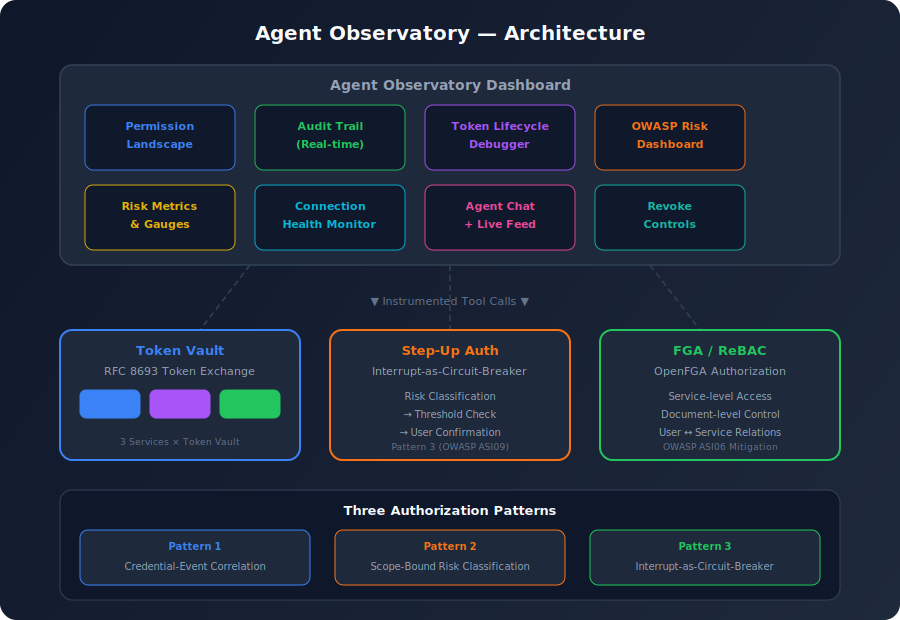
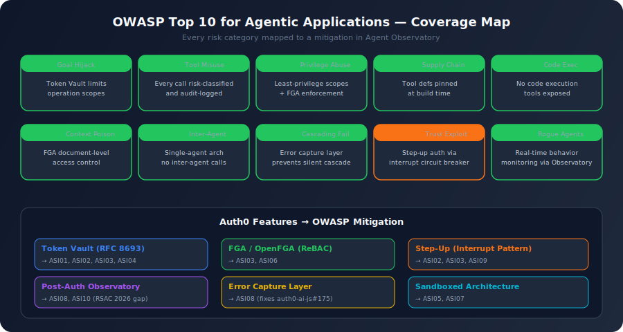

# Agent Observatory

> **Post-authentication observability for AI agents.** See what your agent does *after* it authenticates.

Built for the [Authorized to Act: Auth0 for AI Agents](https://authorizedtoact.devpost.com/) hackathon.

## The Problem

At RSAC 2026, five major vendors shipped agent identity frameworks. None of them tracked what the agent did **after** authentication succeeded ([VentureBeat, March 2026](https://venturebeat.com/security/rsac-2026-agent-identity-frameworks-three-gaps)). The OWASP Top 10 for Agentic Applications catalogues the risks that emerge precisely in this post-authentication space: agents hijacking goals (ASI01), misusing legitimately granted tools (ASI02), and abusing inherited privileges (ASI03).

**Agent Observatory** makes post-authentication AI agent behavior observable, auditable, and controllable -- using Auth0's existing identity primitives.

## Architecture



## Auth0 Features Used

| Feature | Usage | OWASP Mapping |
|---------|-------|---------------|
| **Token Vault** | RFC 8693 token exchange for Google Calendar, GitHub, Slack | ASI02, ASI03 |
| **Token Vault Interrupts** | Step-up authorization as circuit breaker for high-risk ops | ASI09 |
| **FGA Pattern (in-memory demo)** | Service-level + scope-level access control (ReBAC pattern) | ASI03 |
| **Universal Login** | User authentication via @auth0/nextjs-auth0 | ASI03 |

## OWASP Top 10 for Agentic Applications Coverage

| Risk | Code | Our Mitigation |
|------|------|----------------|
| Agent Goal Hijack | ASI01 | Token Vault limits operations to defined scopes |
| Tool Misuse & Exploitation | ASI02 | Every tool call risk-classified and logged |
| Identity & Privilege Abuse | ASI03 | FGA service + scope authorization + least-privilege scopes + post-auth monitoring |
| Agentic Supply Chain | ASI04 | Tool definitions pinned at build time |
| Unexpected Code Execution | ASI05 | No code execution tools exposed |
| Memory & Context Poisoning | ASI06 | Not currently addressed (would require RAG integration) |
| Insecure Inter-Agent Comm | ASI07 | Single-agent architecture, no inter-agent calls |
| Cascading Failures | ASI08 | Error capture prevents silent cascading |
| Human-Agent Trust Exploitation | ASI09 | Interrupt-as-circuit-breaker for write ops |
| Rogue Agents | ASI10 | Real-time behavior monitoring via Observatory |



## Three Authorization Patterns

### Pattern 1: Credential-Event Correlation
By logging token exchange events alongside tool execution events, we can answer: "Which tool calls consumed credentials from Service X in the last hour?"

### Pattern 2: Scope-Bound Risk Classification
OAuth scopes encode what an agent *can* do. By classifying scopes into risk tiers (read-only vs. write vs. administrative), we compute a per-operation risk score. `calendar.freebusy` (read availability) carries lower risk than `chat:write` (send messages).

### Pattern 3: Interrupt-as-Circuit-Breaker
Auth0's `TokenVaultInterrupt` mechanism generalizes to any authorization boundary. When a risk threshold is exceeded, throwing an interrupt pauses agent execution and surfaces the decision to the user -- converting the post-authentication gap from a silent failure mode into an explicit control point.

## Key Differentiators

### Token Vault Debugger
The #1 developer pain point: Token Vault setup is a 10-step process with a single uninformative error (`Federated connection Refresh Token not found`). Our debugger shows:
- Per-connection token state and health scores
- Exchange timeline and error history
- Configuration checklist per service
- Known error reference (auth0-ai-samples#66, auth0-ai-js#175)

### Post-Auth Audit Trail
Every `getAccessTokenFromTokenVault()` call is instrumented to record: which tool requested the credential, what scopes were used, when the token was exchanged, and whether the operation succeeded. This directly addresses the RSAC 2026 gap.

### Error Capture Layer
Auth0 SDK issue [auth0-ai-js#175](https://github.com/auth0/auth0-ai-js/issues/175) documents that federated connection errors are silently discarded. Our Observatory wraps every tool call to capture and surface these errors.

## Tech Stack

| Layer | Technology |
|-------|-----------|
| Frontend | Next.js 16 + shadcn/ui + Tailwind CSS |
| Auth | @auth0/nextjs-auth0 |
| Token Vault | @auth0/ai-vercel (v5.1.0) |
| AI Framework | Vercel AI SDK v6 |
| LLM | OpenAI GPT-4o |
| Visualization | Custom dashboard components |

## Setup

### Prerequisites
- Node.js 20+
- Auth0 tenant with Token Vault enabled
- OpenAI API key

### 1. Clone and install
```bash
git clone <repo-url>
cd Astrolabe
npm install
```

### 2. Configure Auth0

1. Create a Regular Web Application in Auth0
2. Enable Token Exchange grant type
3. Configure social connections:
   - **google-oauth2**: Enable Calendar scopes, "Connected Accounts for Token Vault", "Offline Access"
   - **github**: Enable repo scope, "Connected Accounts for Token Vault"
   - **slack**: Enable channels:read + chat:write, "Connected Accounts for Token Vault"
4. Enable MRRT (Multi-Resource Refresh Token) policy
5. Activate My Account API

### 3. Set environment variables
```bash
cp .env.example .env.local
# Fill in your values
```

### 4. Run
```bash
npm run dev
```

## Project Structure

```
src/
  app/
    api/
      chat/route.ts              # AI chat with Token Vault tools
      observatory/events/         # Observatory event API
    dashboard/
      page.tsx                    # Overview dashboard
      chat/page.tsx               # Agent chat interface
      observatory/page.tsx        # Full observatory dashboard
      debugger/page.tsx           # Token Vault debugger
    page.tsx                      # Landing page
  components/
    chat/                         # Chat UI with interrupt handling
    observatory/                  # Dashboard visualizations
    layout/                       # Navbar, theme provider
  lib/
    auth0.ts                      # Auth0 client (lazy init)
    auth0-ai.ts                   # Token Vault wrappers
    tools/                        # Instrumented AI tools
    observatory/                  # Event store + risk classifier
    fga/                          # FGA authorization model
```

## Blog Post

See [BLOG-POST.md](./BLOG-POST.md) for the full technical write-up: *"What Happens After Your Agent Authenticates? Building Post-Auth Observability with Auth0 Token Vault"*

## Insights & Feedback

See [FEEDBACK.md](./FEEDBACK.md) for the full actionable feedback submission (6 items with issue references).

### For Auth0 Product Team (Summary)
1. **Token Vault needs a diagnostic API** -- `GET /api/v2/token-vault/diagnostics` (ref: auth0-ai-samples#66)
2. **Silent error swallowing** -- Add `onError` callback to `withTokenVault` (ref: auth0-ai-js#175)
3. **Post-auth event logging** -- Token exchange events in Auth0 Logs (RSAC 2026 gap)
4. **Scope risk classification API** -- First-party scope-to-risk mapping
5. **useInterruptions type fix** -- Generic preservation for typed useChat (ref: auth0-ai-js#258)
6. **MCP tutorial fix** -- Missing Authorization header in Python FastMCP (ref: auth0-ai-samples#62)

### References
- South, T. et al. (2025). "AI Agents Need Authenticated Delegation." ICML 2025. arXiv:2501.09674
- OWASP GenAI Security Project. (2025). "OWASP Top 10 for Agentic Applications."
- VentureBeat. (2026). "RSAC 2026 shipped five agent identity frameworks and left three critical gaps open."
- IETF. (2025). "OAuth 2.0 Token Exchange." RFC 8693

## License

MIT
