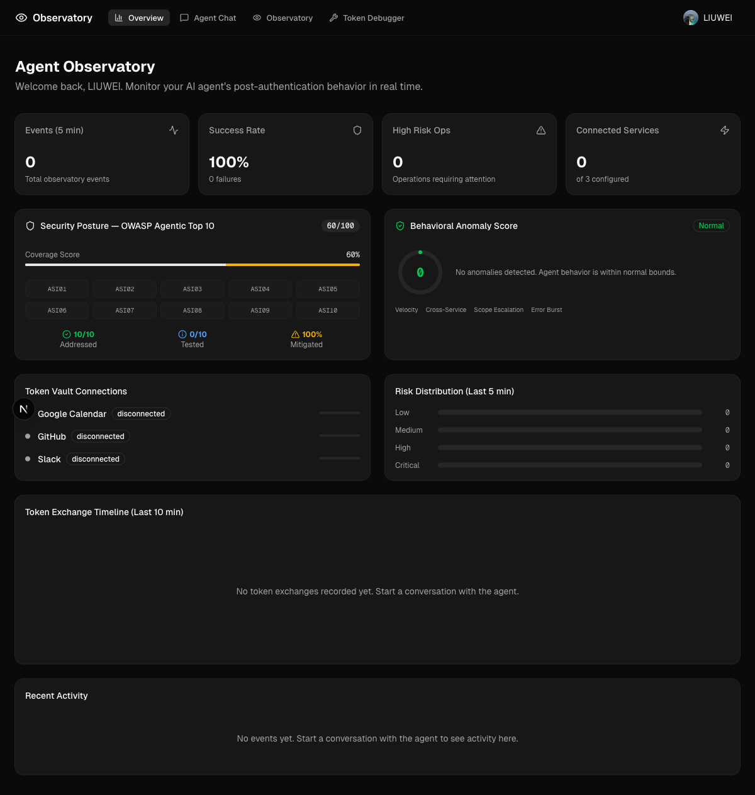
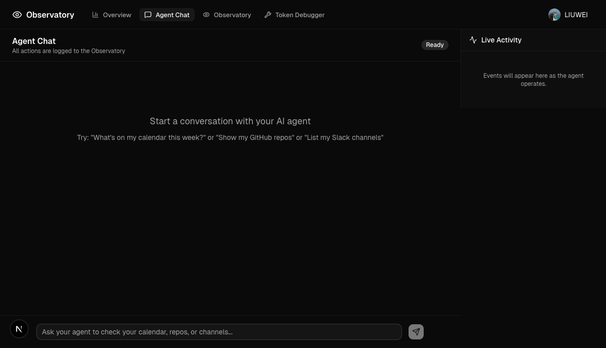
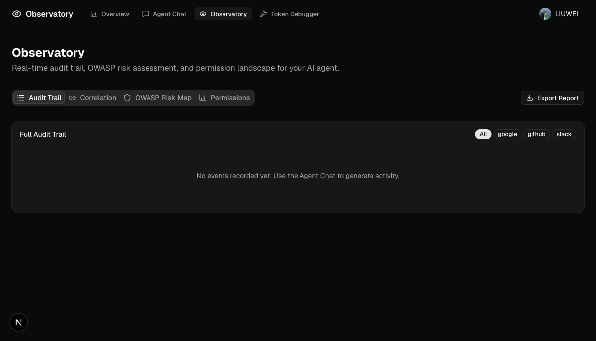
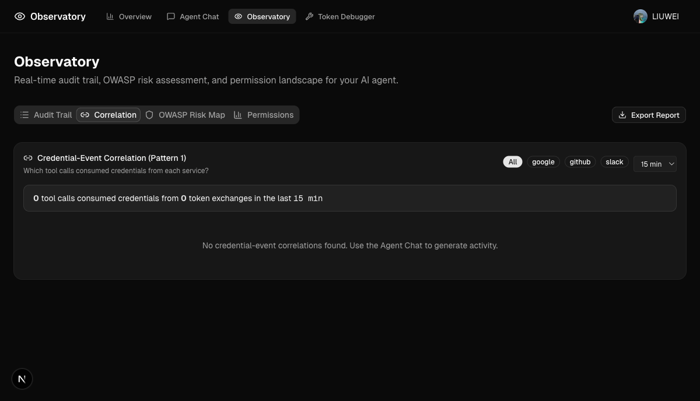
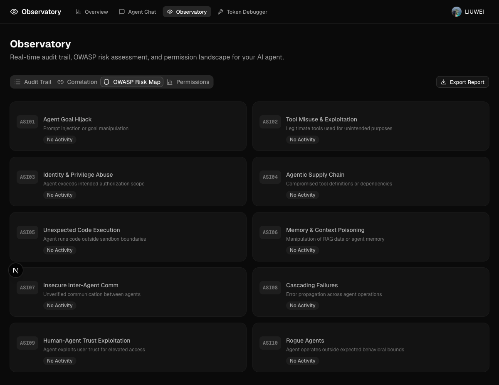
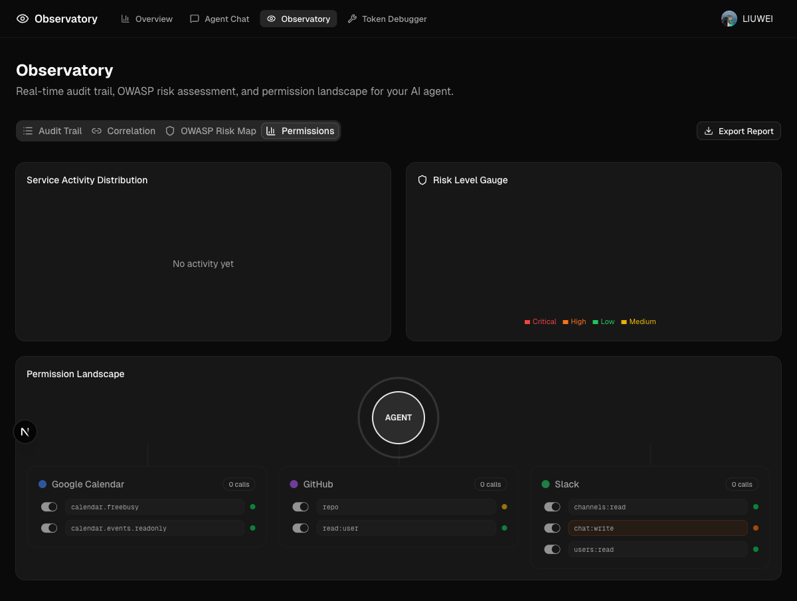
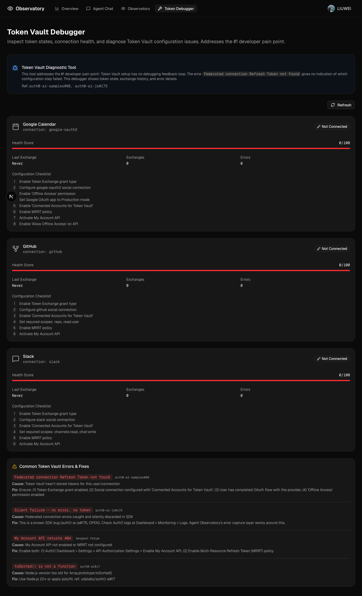
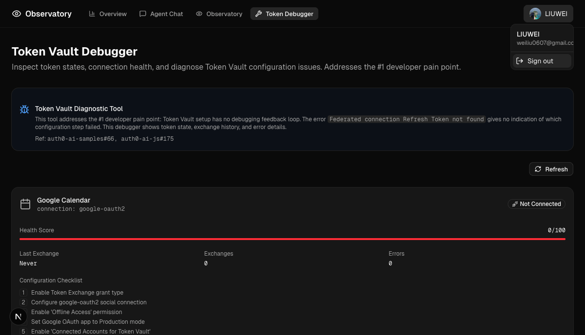
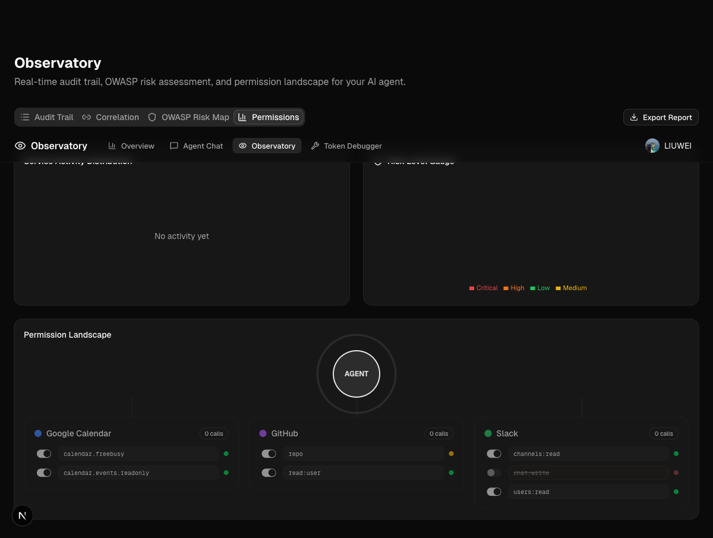

# Agent Observatory — Live E2E Spec

> Auto-maintained by Playwright click-through. Each screenshot corresponds to a verified UI state.
> Last updated: 2026-04-05T05:02 UTC

## Test Environment
- URL: http://localhost:3000
- Auth: Google OAuth via Auth0 (user: LIUWEI)
- Browser: Playwright Chromium
- Console Errors: **0**

---

## 1. Dashboard Overview (`/dashboard`)

- **Status**: PASS
- KPI cards: Events (0), Success Rate (100%), High Risk Ops (0), Connected Services (0/3)
- Security Posture: OWASP Agentic Top 10 grid — 10/10 addressed, 60/100 score
- Behavioral Anomaly Score: 0 (Normal)
- Token Vault Connections: Google Calendar, GitHub, Slack (all disconnected)
- Risk Distribution: Low/Medium/High/Critical bars
- Token Exchange Timeline (last 10 min)
- Recent Activity feed

## 2. Agent Chat (`/dashboard/chat`)

- **Status**: PASS
- Chat input with placeholder text
- Send button (disabled when empty)
- Status badge: "Ready"
- Live Activity sidebar (event feed)
- Suggested prompts displayed

## 3. Observatory — Audit Trail (`/dashboard/observatory`)

- **Status**: PASS
- 4 tabs: Audit Trail | Correlation | OWASP Risk Map | Permissions
- Export Report button
- Service filter badges: All / google / github / slack — all clickable, PASS

## 4. Observatory — Correlation Tab

- **Status**: PASS
- Credential-Event Correlation (Pattern 1) card
- Service filter badges + time range selector (5 min / 15 min / 1 hour)
- Summary: "0 tool calls consumed credentials from 0 token exchanges"

## 5. Observatory — OWASP Risk Map Tab

- **Status**: PASS
- 10 OWASP ASI01–ASI10 cards rendered in 2-column grid
- Each card shows: code, name, description, activity status
- All showing "No Activity" (expected — no agent interactions yet)

## 6. Observatory — Permissions Tab

- **Status**: PASS
- Service Activity Distribution pie chart
- Risk Level Gauge (radial bar)
- Permission Landscape: central AGENT node → 3 service nodes
- Scope toggle switches for all 7 scopes across 3 services

## 7. Token Debugger (`/dashboard/debugger`)

- **Status**: PASS
- Diagnostic banner with issue references (auth0-ai-samples#66, auth0-ai-js#175)
- Refresh button
- 3 service cards: Google Calendar, GitHub, Slack
  - Each shows: health score, last exchange, exchanges count, errors count
  - Configuration checklist (shown when not connected)
- Common Token Vault Errors & Fixes reference section (4 known errors)

## 8. User Menu (dropdown)

- **Status**: PASS
- Shows user name (LIUWEI) and email
- Sign out link → `/auth/logout`

## 9. Scope Toggle — Deny/Allow

- **Status**: PASS
- Toggled `chat:write` OFF for Slack → visual feedback (strikethrough, red dot, dimmed)
- Backend verified: `GET /api/observatory/scope-toggle` returns `{"deniedScopes":{"slack":["chat:write"]}}`
- Toggled back ON → restored to normal state
- **Frontend ↔ Backend**: confirmed round-trip

## 10. Export Report
- **Status**: PASS
- Clicked "Export Report" → downloaded `observatory-report-2026-04-05.json`
- File contains: metadata, owaspCoverage, serviceSummary, anomalyScore, riskTimeline, events

## 11. Security Headers
- **Status**: PASS
- `X-Frame-Options: DENY`
- `X-Content-Type-Options: nosniff`
- `Referrer-Policy: strict-origin-when-cross-origin`
- `Permissions-Policy: camera=(), microphone=(), geolocation=()`

---

## Summary

| Page / Feature | Status | Screenshot |
|----------------|--------|------------|
| Landing Page (unauthenticated) | PASS | — |
| Auth0 Login → Google OAuth | PASS | — |
| Dashboard Overview | PASS | 01 |
| Agent Chat | PASS | 02 |
| Observatory — Audit Trail | PASS | 03 |
| Observatory — Correlation | PASS | 04 |
| Observatory — OWASP Risk Map | PASS | 05 |
| Observatory — Permissions | PASS | 06 |
| Token Debugger | PASS | 07 |
| User Menu Dropdown | PASS | 08 |
| Scope Toggle (deny/allow) | PASS | 09 |
| Export Report (download) | PASS | — |
| Security Headers | PASS | — |
| Filter Badges (All/google/github/slack) | PASS | — |
| Console Errors | **0** | — |

**Total: 15/15 PASS**
